# **SKILLSHOP**

Website project by Amira Val Baker

## Application Purpose

Skillshop is a service provider application. It allows users as skilled service providers to create listings offering their skill as a service. It allows users looking for the services of a skilled provider to search for a specific skill within a specified radius from their location. 

## Repository

The Github repo can be found here.

https://github.com/amiravalbaker/skillshop

The deployed app can be found here:

https://skillshop-0fb3d806d75d.herokuapp.com/

## Agile Planning

This project followed an agile methodology utilising a project board, user stories and wireframes.

The project Board, with user stories can be found here.

https://github.com/users/amiravalbaker/projects/10

## Design Layout ##

The application provides a simple design centred around the application logo set on a white background.

#### Wireframes

The wireframes were drawn by hand.

**Home Page**

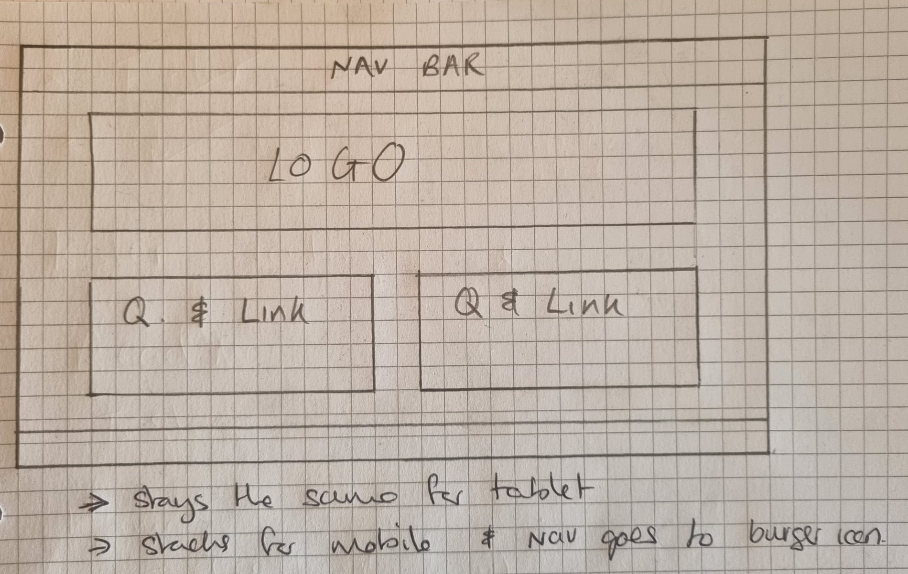 

**Search page**

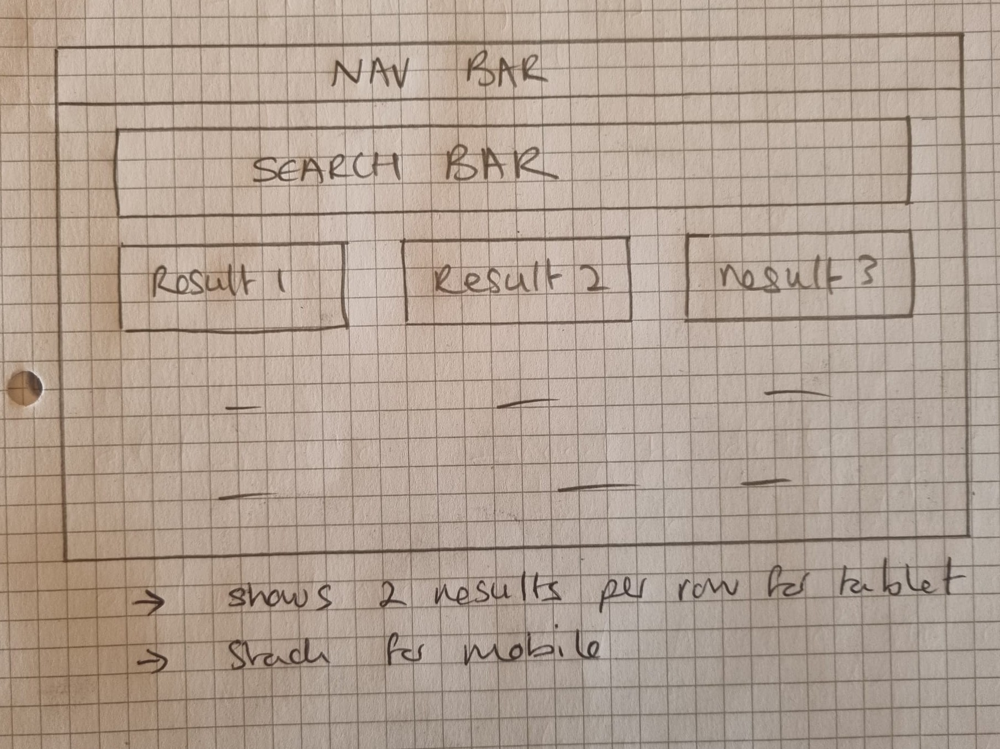

**Listing/Profile page**

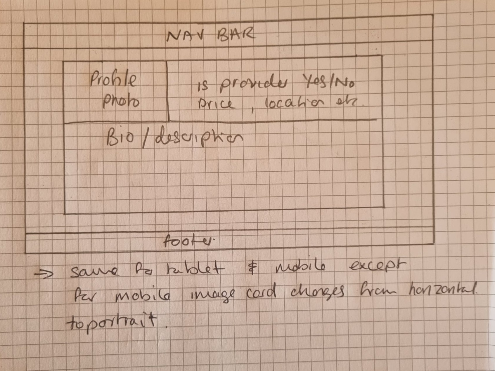 

**Logo**

The logo was made using photoshop and stylised with AI.
The image on lthe eft is the original and the image on the rigght is after AI made it look "stylish and professional.

**Colour Palette**

A colour palette was found from the image using the website https://imagecolorpicker.com/. 

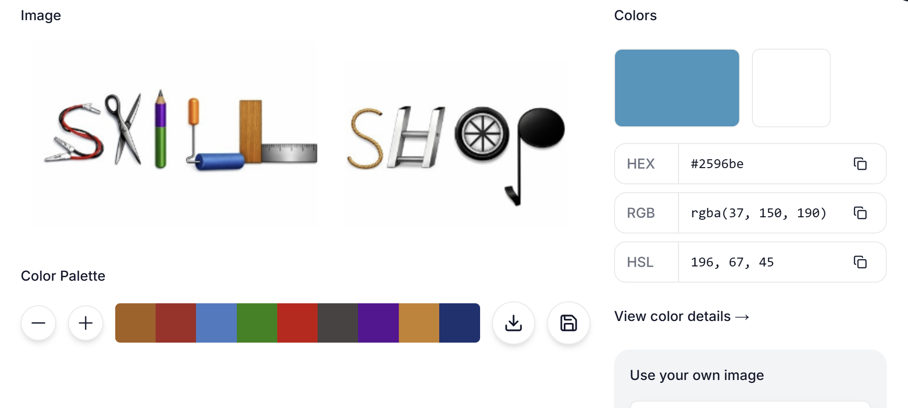 

The colour theme was chosen as purple
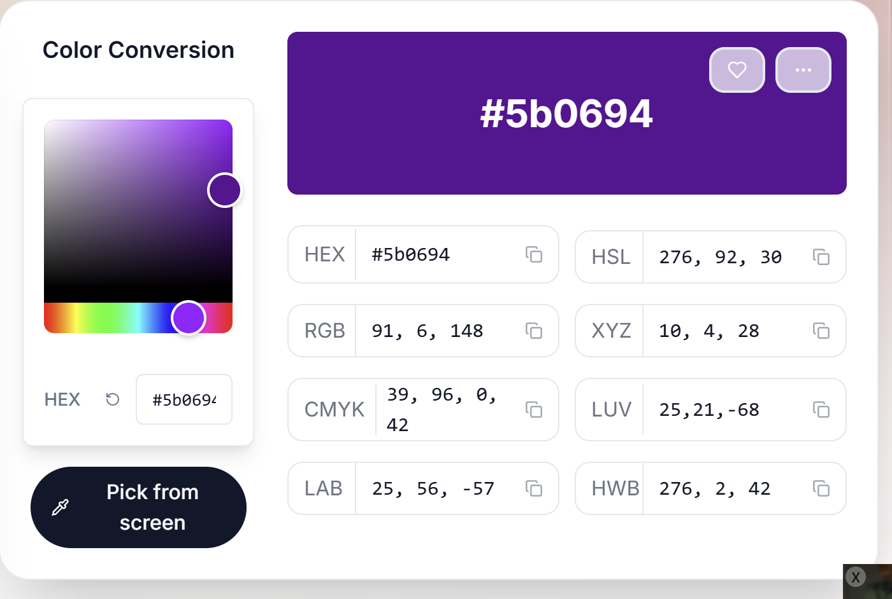

## Database ##

Skillshop uses PostgreSQL as its primary database. 

The database was created with the use of Python classes, known as models in the Django framework. These models define the structure of your database table.

### The models

The models are written in the models.py file in the app called skills. 
There are 8 models: 

1. **User Model**

   This is the built-in Django User model which includes fields like id, username, email, and password. 

2. **Profile Model**

3. **Listing Model**

4. **Location Model**

5. **Skill Model**

6. **Review Model**

7. **Conversation Model**

8. **Message Model**

The models are defined using an Entity Relationship diagram. 

I used https://dbdiagram.io to to define your database structure and create my ERD.

Table User {
id integer
 username Charfield
email EmailField
password Charfield
 created_at DateTimeField
}

Table Profile {
user	OneToOneField [Ref: - User.id]
is_provider	Boolean
created_at	dateTime
bio	TextField
image	Cloudinary 
}

Table Listing {
provider	ForeignKey
skill	ForeignKey
service_radius	DecimalField
title	CharField
description	TextField
price	DecimalField
location	DecimalField
mobile_home	Boolean
}

Table Location {
name	CharField
latitude	DecimalField
longitude	DecimalField
}

Table Skill {
name 	CharField
description	CharField
}

Table Review {
listing	ForeignKey 
reviewer	ForeignKey
rating	int
comment	TextField
created_at	TimeDateField
}
Table Conversation {
participants	ManyToMany
}

Table Message {
conversation	ForeignKey
sender	ForeignKey
content	TextField
created_at	TimeDateField}

Ref:Profile.user<Listing.provider
Ref: Profile.user<Review.reviewer
Ref: Listing.provider<Review.listing
Ref: Skill.name<Listing.skill
Ref:Message.conversation< Conversation.participants
Ref: Message.sender<Profile.user
Ref listing_location: Listing.location <>Location.name // many-to-many
Ref profile_conversation: Profile.user <> Conversation.participants  // many-to-many

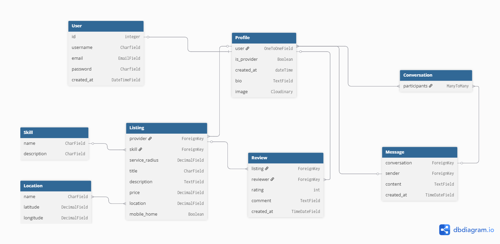

### The Views 
These define what we send to the browser. It needs to be able to receive information and output information from the user via the TEMPLATE. It also needs to be able to query and manipulate the data structure. So this is where the logic happens.
I had 12 views in my *views.py* file:
1. home
2. profile_view
### Template – 
this is what the user sees. It receives information from the user and gives it to the View and returns information to the User from view. It also receives updates from the Model

## JavaScript ##

Java Script was used for:

1. adding a new skill to the drop down menu, *listings.js
2. search functionality which allows the user to find their location, geolocate.js

## AI Usage

AI was used for:
 1. Advice with structuring the models

2. Generating code from logic instructions especially the views and templates. 

3. Debugging and fixing errors in the code and deployment issues.

4. Stylizing the logo

## Deployment

Deploying the application to heroku was done as follows:

   - Project uploaded to a github repository
   - Gunicorn installed and configured
   - All dependencies are listed in r*equirements.txt*
   - python version is listed in *.python-version*
   - set up and configure environmental files in *env.py*
   - create a *Procfile* - to tell Heroku how to run your application.
   - ensure that any files that contain secret keys or other sensitive information is added to *.gitignore* and is not present in your github repository
   - Create heroku app
   - Link github repository
   - Link PostGres database
   - Add environmental variables to heroku, such as, secret keys.
   - Deploy the application

The deployed app can be found here:

https://skillshop-0fb3d806d75d.herokuapp.com/

## Testing

I did manual testing for all my user storeis. See results below:

| **USER STORY** | **ACTION** | **EXPECTED RESULT** | **TEST** |
|----------------|------------|----------------------|----------|
| **User SignUp** | Navigate to signup page. Enter valid details and submit. | User is registered and redirected to the home page with a confirmation message that they have signed up and a link to their profile in the nav bar. | PASS |
| **User SignUp** | Attempt to register with an existing username or email. | Gives warning message: "A user with that username already exists." | PASS |
| **User Login** | Navigate to the login page. Fill in the form with valid credentials and submit. | User is logged in and redirected to the home page with a confirmation message and a link to their profile in the nav bar. | PASS |
| **User Login** | Attempt to log in with invalid credentials. | Gives warning message: "The username and/or password you specified are not correct." | PASS |
| **User Logout** | While logged in, click the logout button. | User is asked for confirmation and upon confirming is logged out and redirected to the home page. | PASS |
| **View Profile** | Navigate to the profile page. | User clicks link in the navbar and is redirected to the profile page. | PASS |
| **Edit Profile** | Navigate to edit profile page. | User selects edit profile button and is redirected to the edit profile page. | PASS |
| **Edit Profile** | Make edits to your profile. | User updates their details and submits. They are redirected to their profile page with a confirmation message. | PASS |
| **Update Profile Image** | On the profile page, upload a new profile picture. | Profile picture is updated and displayed correctly. | PASS |
| **Delete Profile** | Delete profile from edit profile page. | User selects delete profile with a warning message asking if they are sure. If they confirm, they are redirected to the home page with a confirmation message. | PASS |
| **Create Listing** | Create a new listing. | A user with the provider option enabled in their profile can navigate to the create listing page from the nav bar, home page, or profile page. | PASS |
| **Edit Listing** | Edit a listing from the listing page. | User selects edit listing, is taken to the edit listing page, makes edits, submits, and is redirected to the listing page with a confirmation message. | PASS |
| **Delete Listing** | Delete listing from edit listing page. | User selects delete listing with a warning message asking if they are sure. If they confirm, they are redirected to the home page with a confirmation message. | PASS |
| **Search listings by skill** | Search for a skilled provider from the search page. | User selects a skill from the dropdown menu, clicks search, and the search results are shown below. | PASS |
| **Search listings by location** | Search for a skilled provider by location. | User selects location by detecting location or typing manually, clicks search, and results appear ordered by distance. | PASS |
| **Search listings by radius** | Search within a certain radius. | User selects desired radius, clicks search, and results appear ordered by distance. | PASS |
| **Contact listing provider** | Contact the skilled provider from their listing page. | User selects "message provider", is redirected to a messaging page, writes a message, submits, and sees the message in conversation detail. | PASS |
| **Leave Review** | Leave a review on the listing page. | A user who has had a conversation with the provider can leave a review, submit, and the review appears immediately. | PASS |
| **Edit Review** | Edit your review from the listing page. | User selects edit review, updates it, submits, and the updated review appears immediately. | PASS |
| **Delete Review** | Delete review from listing page. | User selects delete review with a warning message asking if they are sure. If they confirm, they are redirected to the listing page with a confirmation message. | PASS |

## Responsivity

The site is mostly responsive from desktop to tablet, to mobile.

The only issue is with the carousel images when at tablet size which do not always fit correctly. This will be updated in a furure iteration.

## Future Developments

### Account Reset Using Email

Currently the user can only login with a username and password and there is no functionality for them to reset their password. This can be done using ALLauth and using a server such as SendGrid, which I plan to do for a later iteration

### Image uploads

Currently the user can only upload a profile image and 3 additional images for their listing, if they have a listing. For a better UX the functionality should allow for more images to be uploaded and also more feedback when they upload their images.

### Messaging

The messaging functionality is for a small number of messages. As users increase it could become confusing for users, so this functionality would need to be improved.

## Validation

### Lighthouse

LIghthouse Performance test:
https://developer.chrome.com/docs/lighthouse

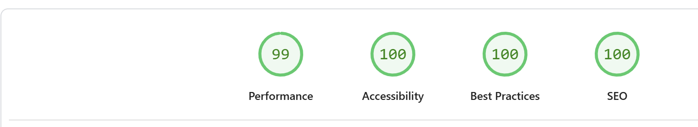

The main issues are:

[performance results](docs/images/lighthouse_accessibility.png)

[performance results](docs/images/lighthouse_bestpracticse.png)

These issues will be improved in a later iteration.

### Accessibility

Accessibility checker: 
https://accessibilitycheck.friendlycaptcha.com/ 

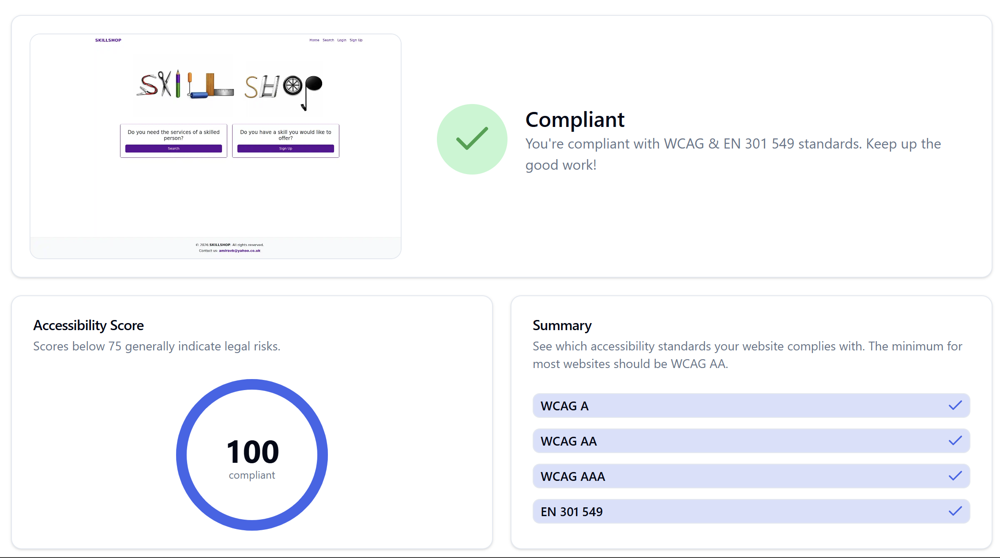

### HTML

HTML validator: 
https://validator.w3.org/nu/#textarea 

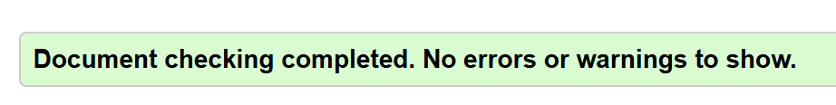

### CSS

CSS Validator: https://jigsaw.w3.org/css-validator/ 

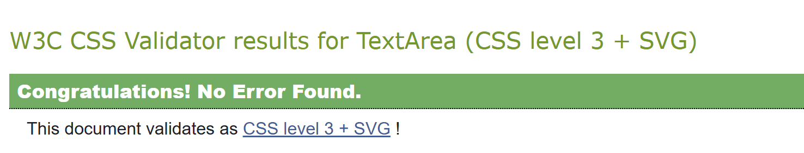

### Java script
Java script validator:
https://validatejavascript.com/ 

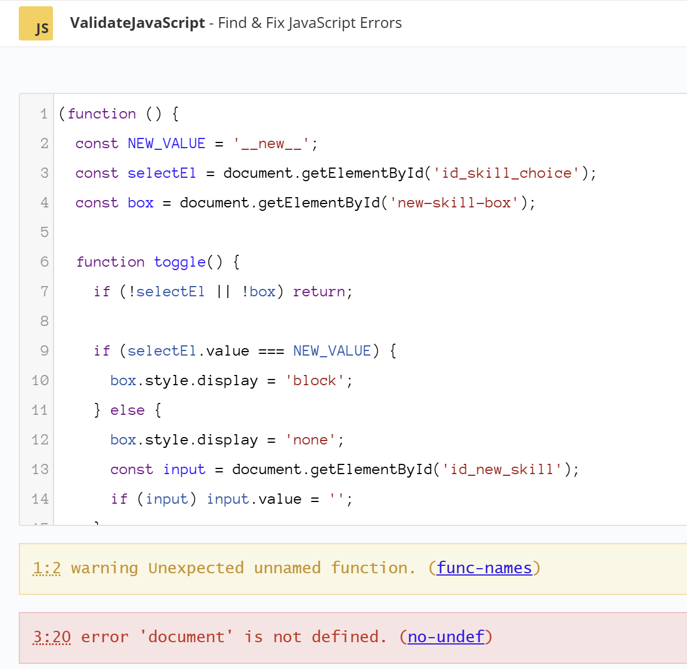
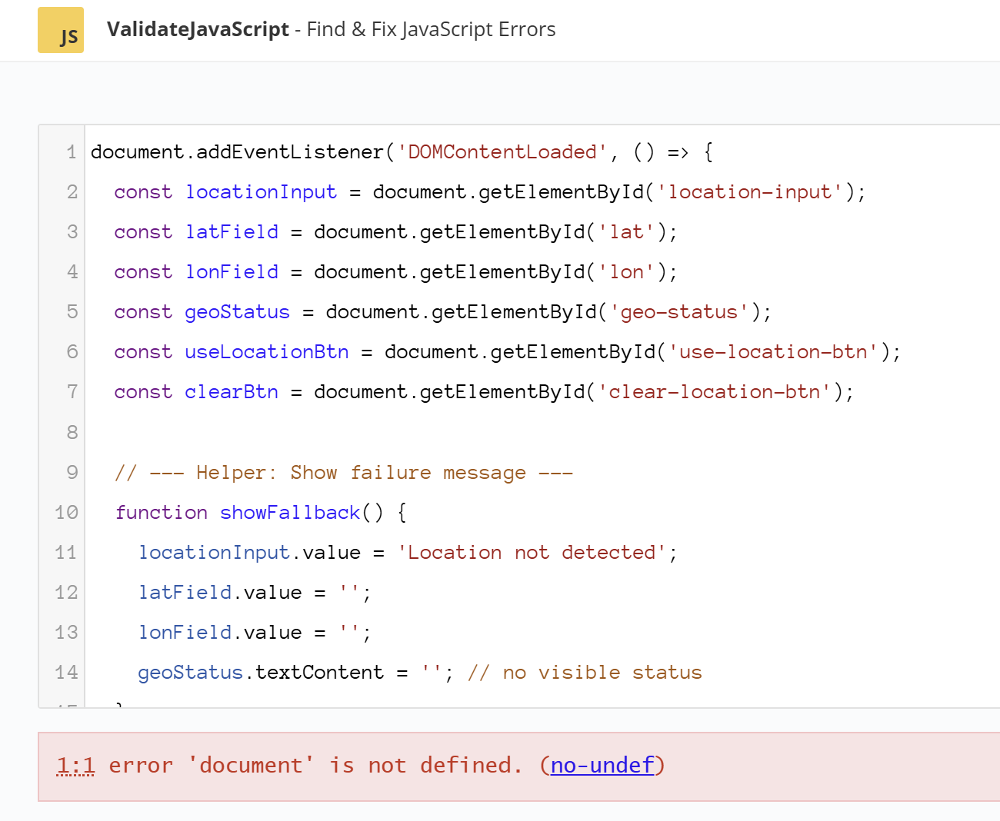

### Python

Python validator: 
https://pep8ci.herokuapp.com/ 

**models.py:**

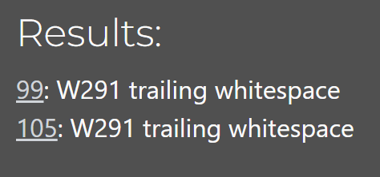

**settings.py**

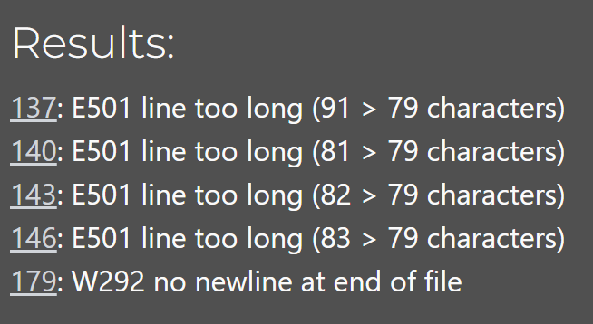

**views.py**

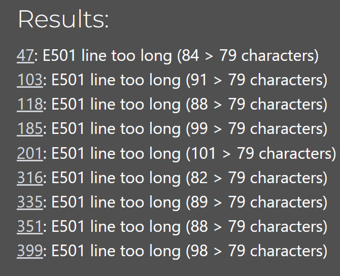

**admin.py, forms.py, urls,py**

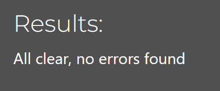